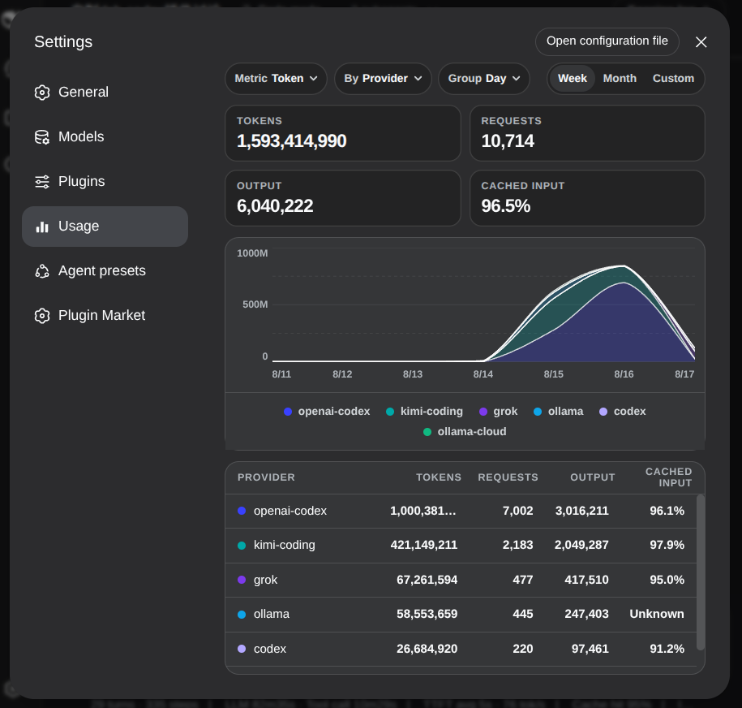

# dsh-usage-monitor

[English](README.md) | 中文

[DeepSeek Harness](https://github.com/deepseek-ai/deepseek-harness) 的用量看板。从会话日志里折出供应商上报的 token usage，在设置页画图。



## 展示

- Tokens、请求数、输出 token、缓存命中率
- 堆叠图：指标（Token / 请求）× 分组（供应商 / 模型 / 工作区）× 粒度（日 / 周）
- 近一周、近一月、自定义范围
- 底表跟随当前 By 分组

不查询订阅额度。

## 安装

需要 DeepSeek Harness 0.1.0-rc.6 或更新。从 GitHub 安装：

```sh
dsh plugin --profile web add github:NOirBRight/dsh-usage-monitor#v0.2.1
dsh web
```

仓库跟踪已构建的 lib 产物，GitHub 安装不需要允许构建脚本。源码检出可在 `pnpm run build` 后用 link 安装。

然后打开 **设置 → 用量**。

## 数据

走 `ctx.sessionQuery`（含进行中和已落盘会话）。不直接读 `session.jsonl.zstd`，也不读社区插件留下的缓存。
